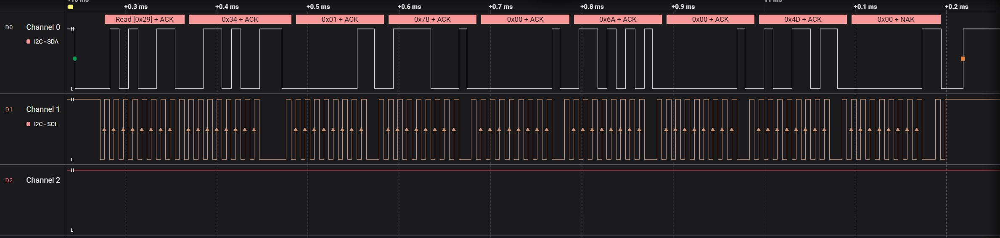
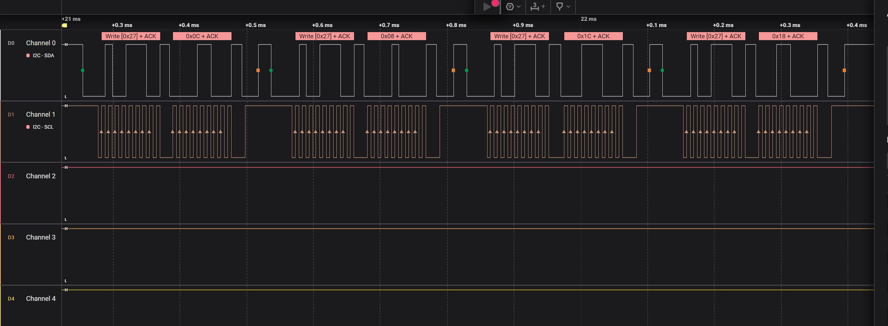
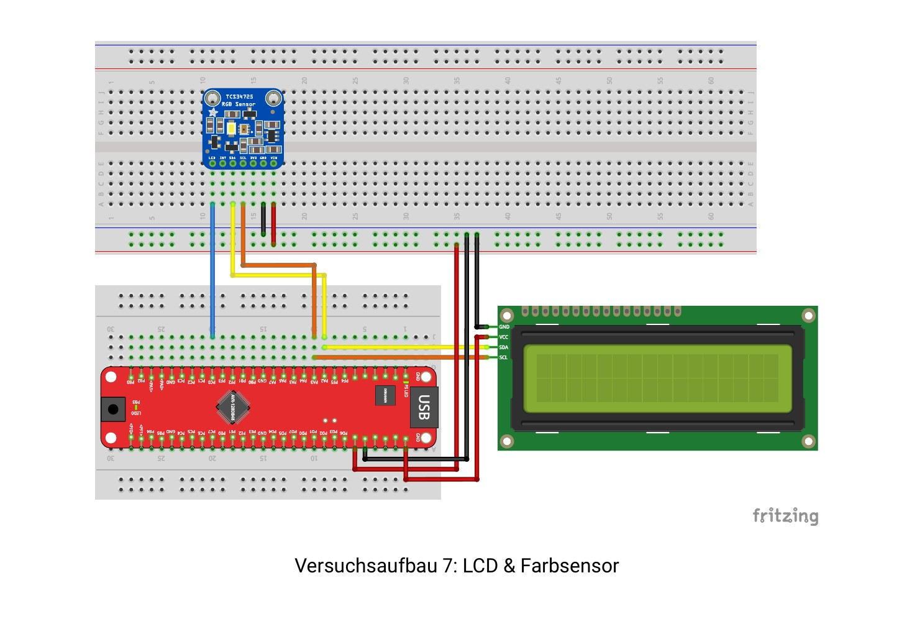

# 🔌 Übung 9: I²C – LCD & Farbsensor

Dieses Projekt gehört zur Praktikumsreihe im Fach **Mikroprozessortechnik** . Ziel dieses Versuchs ist das Verständnis und die praktische Anwendung des **I²C-Busses** zur Kommunikation zwischen einem Mikrocontroller, einem LCD-Display und einem Farbsensor.

---

## 📚 Der I²C-Bus

Der **Inter-Integrated-Circuit-Bus (I²C)** dient zur Kommunikation innerhalb eingebetteter Systeme über kurze Distanzen.  
Er folgt dem *Controller-Peripheral-Prinzip*, wobei der **Controller** die Kontrolle übernimmt und das **Peripheral** auf Anfragen reagiert.

### 🧠 Grundlagen

- Zwei Hauptleitungen: **SDA** (Datenleitung) und **SCL** (Taktleitung)
- Kommunikation erfolgt sequentiell über ein gemeinsames Busprotokoll
- Mehrere Geräte können angeschlossen werden, identifiziert über Adressen (7- oder 10-Bit in unserem Fall 7-bit)

### 🔄 Kommunikationsablauf:

1. Startbedingung senden: `SDA → VON HIGH AUF LOW`, während `SCL → HIGH`
2. Adresse des Peripherals senden
3. Lesen (`1`) oder Schreiben (`0`) auswählen
4. Acknowledge durch das Peripheral
5. Daten senden oder empfangen
6. Empfang bestätigen (ACK/NACK)
7. Stoppbedingung: `SCL → HIGH`, `SDA → HIGH`

Mehr Infos: [Sparkfun Tutorial über I²C](https://learn.sparkfun.com/tutorials/i2c/all) ODER MPT_I2C_DOKU lesen

---

## 🔬 Teil 9.1: Farbsensor

Wir verwenden das Modul **"DEBO SENS COLOR"**, das den **TCS34725** Sensor nutzt.

- Erkennt Farbanteile von **Rot, Grün, Blau und Klar**
- Kommuniziert per I²C
- ADC + Digitalfilter inklusive
- Bibliothek: `I2C_LCD.h, util/delay.h, avr/interrupt.h, avr/io.h, stdio.h` 

📌 **Aufgabe:**  
Zeigen Sie mit dem LCD die ermittelten Farbwerte (Rot, Grün, Blau) für verschiedene Objekte an.

---

## 🧪 Teil 9.2: Logic Analyzer

Prüfen Sie die I²C-Kommunikation mithilfe eines **Logic Analyzers** (z. B. Salae Logic):

- Verfolgen Sie den Datenverlauf auf SDA & SCL
- Beobachten Sie:
  - Welche Adresse verwendet wird?
  - Welche Daten übertragen werden und von wem?
  - Gibt es ein ACK?

💡 Zwei Beispiele:

### 🟠 Kommunikation mit TCS34725

### 🟢 Kommunikation mit dem LCD

---

## 🔌 Aufbau: LCD & Farbsensor

- LCD-Display über I²C angebunden
- Farbsensor per I²C verbunden
- GND, VCC, SDA, SCL korrekt verdrahtet

---

## 🛠️ Ziel der Übung

- I²C-Kommunikation verstehen und anwenden
- Verschiedene Geräte gleichzeitig über den Bus steuern
- Mit einem Logic Analyzer Protokolle sichtbar machen
- Messwerte sinnvoll auf LCD darstellen

---

## 🧑‍💻 Autor

**Name:** *[DIMITRY NTOFEU NYATCHA]*  
**Kurs:** Mikroprozessortechnik  

---

## 📄 Dokumentation 

- Siehe : MPT_I2C_DOKU.pdf

---

## 🔒 Lizenz / Verwendung

Privates Uni-Projekt – nur zu Lernzwecken.  
Keine öffentliche Weiterverwendung ohne Zustimmung.
